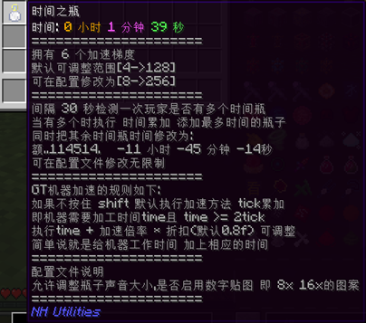
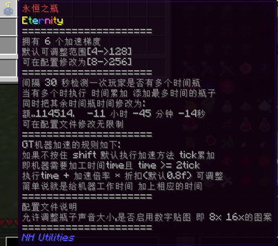
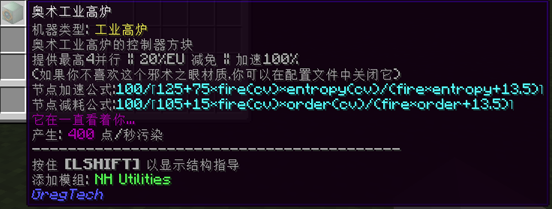
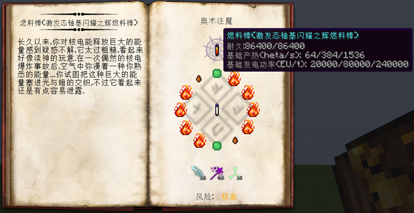
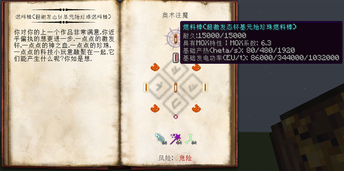

# NH-Utilities
 Add something utilities

---
## 介绍
本模组是GTNH整合包的社区模组，修改和添加了一些东西来帮助玩家更好的渡过前中期。 
**注意**，该MOD并非GTNH整合包内的官方MOD，讨论此MOD时请注意场合。
## 当前已增加内容
### 添加
  - ✔ 移植了高版本的时间瓶，默认支持加速GT机器具体看tooltips详细说明。 
  
  
  - ✔ 移植类似高版本暴食魔符 -> 暴食指环以及饥饿指环。 
  - ✔ 为神秘侧添加了一个mv后期解锁的工业高炉，同时计算电和节点提供的厘魔，最高提供4并行、80%能量减免和100%加速(有新材质 如果觉得新材质丑或者与材质包冲突可以在cfg里面关闭)。 
  
  - ✔ 添加了超级午餐盒，内置54个格子。 
  
  - ✔ 添加了神秘侧的注魔燃料棒：闪耀系列和元始珍珠系列。 
   
   
   
  
  - ✔ 默认添加debug维护仓的简单合成。
  - ✔ 添加Kami神环，类似无尽的防御。
  - ✔ 添加新的法杖核心，比emt那个维护法杖核心更强，更实用。 
  
  - ✔ 添加净化之戒，佩戴后不再触发任何扭曲事件，并且放置某些gt方块的时候能清除些微扭曲。 
  
### 修改
  - ✔ 增强了龙研**高级传送器MKII**——支持放入饰品栏/快捷键打开。
  - ✔ lang文件自动重置: 主要是mod版本改变后自动重置备份的lang文件
  可以在config/NHUtilities/NHUtilities.cfg文件下配置
  默认支持TST BOX 可编程舱室 等mod
  需要在和config的同级别路径下(和config在同一个文件夹就行了)
  创建`Lang_Backup`(区分大小写 默认自动生成)这个文件夹
  将你没装私活的lang文件丢进去就行了
  即你的安装包的lang文件扒过去
  > 即 GregTech.lang 文件
  -> GregTech_zh_CN.lang 文件
  - ✔ 去除了超级缸/箱以及JABBA的小推车debuff。
  - ✔ 默认修改EIO谐振电容库与能量注入仪的问题(秒充)。
  - ✔ [默认是关闭的]魔改创世神mod兼容Exu的工具。即治愈之斧也可以当小木斧用，可以在配置文件下开启。
  - ✔ 默认修改时间瓶子支持加速EnderIO机器，同时加速eio机器接收能量的速率。
---
  - × 等待新想法中..

