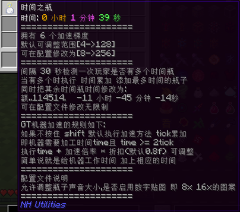
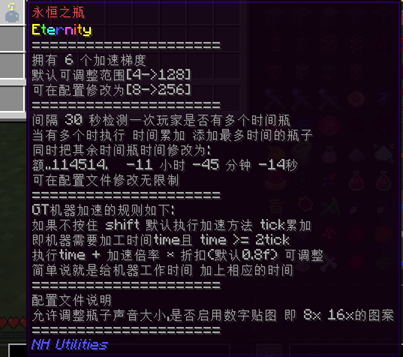
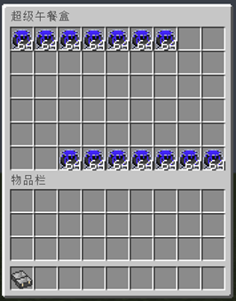
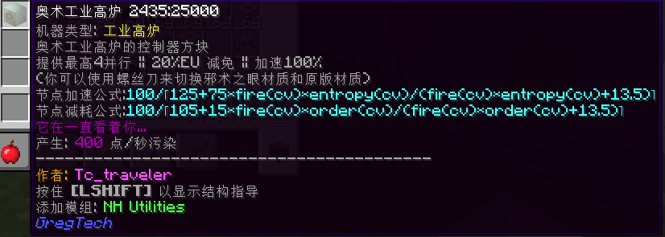
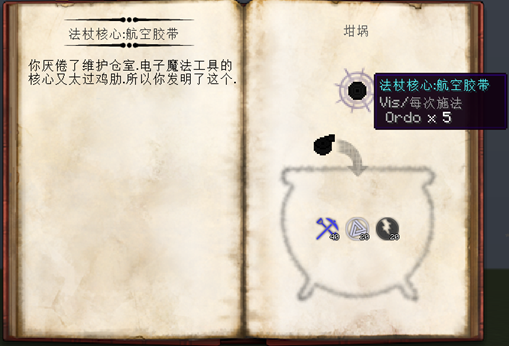
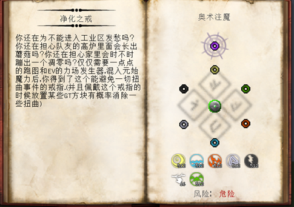
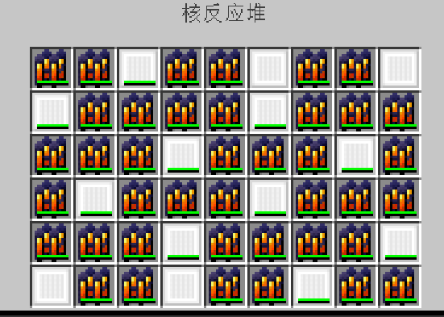
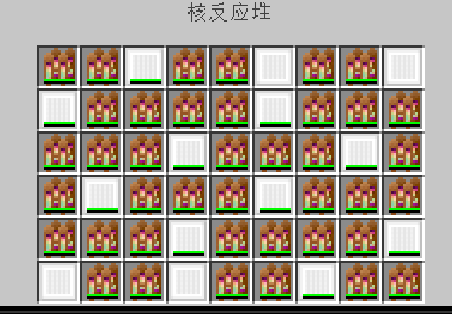
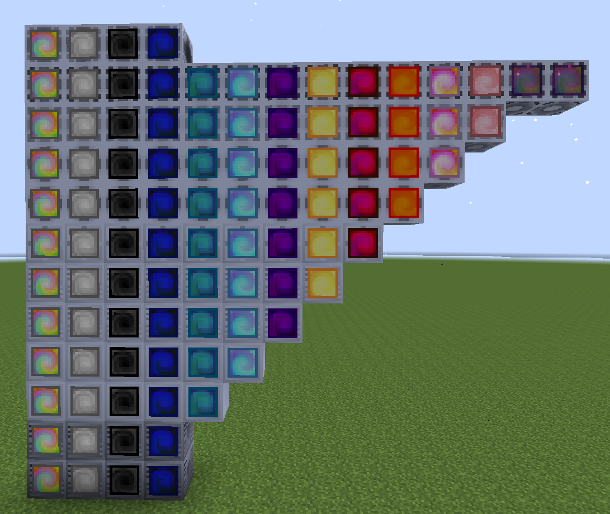
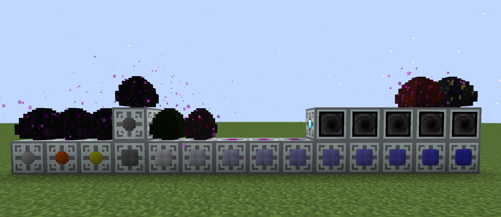

<h1 align="center">NH Utilities</h1>

<em>A collection of utilities for GTNH modpack</em>

<em>May be not-hard utilities for GTNH modpack</em>

  
  
  
  

## 介绍
本模组是为GTNH整合包制作的社区模组

当前主要维护者 Keriils Tc_traveler

通过添加和修改游戏内容帮助玩家更顺畅地度过前中期发展阶段?(或许是老登玩具...)

> [!WARNING]
> 本模组非GTNH官方模组，请勿在官方场合讨论相关内容

## 当前内容

### ✨ 新增内容

<b>⚡ 时间瓶 (GT机器加速)</b>

  
  

<ul>
  <li>支持加速GT机器与EnderIO机器</li>
  <li>提升EIO机器能量接收速率</li>
  <li>具体机制详见物品说明</li>
</ul>

<b>🍔 生存辅助套装(憋😀</b>

  

<ul>
  <li>暴食指环 & 饥饿指环 - 移植高版本暴食魔符机制</li>
  <li>超级午餐盒 - 54格超大容量</li>
  <li>Kami神环 - 类无尽防御系统</li>
</ul>

<b>🔮 神秘时代扩展</b>

  
  
  
   
  
  

<ul>
  <li>新增神秘侧奥术工业高炉 (MV后期解锁)</li>
  <li>更好的维护法杖核心,比Emt的更好！</li>
  <li>净化之戒 - 抑制扭曲效果,申必人也能进工业区了！</li>
  <li>注魔燃料棒系列 (闪耀/元始珍珠)</li>
</ul>

<b>⚙️ GT扩展</b>

  
  

<ul>
  <li>新增投影蓝图'nhu_build_size'信道,以定义多方快构建尺寸</li>
  <li>扩展和修改原版无线系统：
    <ul>
      <li>更多无线覆盖板</li>
      <li>更多无线仓室 (多安能源/动力仓)</li>
      <li>成本优化 - 总体造价降低 - 全局飞无线</li>
      <li>云端算力仓/装配线数据仓成本优化</li>
    </ul>
  </li>
  <li>Debug维护仓简易合成配方</li>
  <li>新增<del>逆天</del>蛋机系统 (与123科技有联动憋憋)</li>
  <li>允许ME舱室传递32个频道</li>
</ul>

### 🛠️ 系统优化

<b>🐉 龙之研究改进</b>

<ul>
  <li>高级传送器MKII现在支持：
    <ul>
      <li>放入饰品栏</li>
      <li>快捷键快速访问</li>
    </ul>
  </li>
</ul>

<b>🎮 游戏体验优化</b>

<ul>
  <li>披萨手套 - 免疫所有槽位烫伤</li>
  <li>强化治愈斧 - 瞬间回满生命值</li>
  <li>移除超级缸/箱及JABBA小推车负面效果</li>
  <li>WorldEdit与ExtraUtils工具兼容 (默认关闭)</li>
  <li>新游戏规则 - doWeatherCycle 天气循环</li>
</ul>

<b>⚙️ 界面与设置</b>

<ul>
  <li>NEI配方来源显示优化</li>
  <li>超频电压原始值显示</li>
  <li>WAILA增加AverageNs显示</li>
  <li>EIO电容库与注入仪秒充机制</li>
</ul>

<b>🌐 本地化支持</b>

  <h4>自动语言文件重置功能</h4>
  <pre>
config/NHUtilities/NHUtilities.cfg
└── 支持私货模组列表配置,可随意添加

操作步骤：
1. 在config同级目录创建 Lang_Backup 文件夹(区分大小写 默认自动生成)
2. 放入原始语言文件 (GregTech.lang和GregTech_zh_CN.lang 文件)
3. 需要是未装私货时的lang文件
4. 游戏每次启动都会执行检查私货版本,如变动则会替换未装私货的lang
  </pre>

## 📥 下载与兼容

|  GTNH 版本  | 起始兼容版本  |    最新兼容版本    |                                                                   下载                                                                    | 维护状态 |
| :-------: | :-----: | :----------: | :-------------------------------------------------------------------------------------------------------------------------------------: | :--: |
|   2.8+    |  1.6.0  |    1.6.0     |              |  ✔️  |
| 280-rc1/2 | 1.5.11  |    1.5.11    |            |  ❌️  |
| 280-beta4 | 1.5.11  |    1.5.11    |            |  ❌️  |
| 280-beta3 |  1.5.9  |    1.5.10    |            |  ❌️  |
| 280-beta2 |  1.5.6  |    1.5.6     |               |  ❌️  |
| 280-beta1 |  1.5.4  |    1.5.5     |               |  ❌️  |
|   2.7+    | 1.3.5+  |    1.5.3     |               |  ❌️  |
|   2.6+    | unknown | 1.3.5-fit261 |  |  ❌   |
